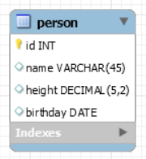
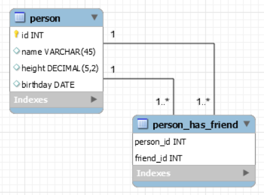

# Repositorio acceso a bases de datos

Este repositorio contiene las clases genéricas necesarias para implementar una capa de acceso a datos a una base de datos tipo MySQL. 
Utilizando las clases de este repositorio se puede trabajar con una base de datos MySQL de una forma sencilla. 
Esto permite que un programa tenga persistencia de datos.

**version**: 1.0

**fecha**: 2023/07/01

**autor**: Sergio Martí Torregrosa

## Actualizaciones

En este apartado se recopilan todos los cambios que se han realizado en el repositorio.

Fecha 17/07/2023

  * Añadida la nueva clase "QueryBuilder": contiene los métodos necesarios para construir queries simples, indicando el nombre de la entidad, el campo de la clave primaria y el resto de campos.
  * Nuevo constructor para "MySQLConnectionUtils": indicando el path del archivo "app.properties" que contiene los datos necesarios para realizar la conexión a la base de datos.

Fecha 18/07/2023

  * QueryBuilder contiene ahora métodos para seleccionar que campos se quieren incluir en la query.
  * MySQLGenericDAO contiene un objeto QueryBuilder.

Fecha 26/09/2023 y 27/09/2023

  * Nuevo paquete Input/Output (IO) con las clases: PlainTextIO y PlainTextGenericDAO. Estas clases permiten escribir y leer la información línea a línea en un archivo de texto plano.

Fecha 04/12/2023

  * Fix: QueryBuilder ahora lanza un error si el número de campos que se quieren filtrar para una consulta de *insert* o *update* son diferentes a los disponibles.
  * QueryBuilder ahora dispone de un método para acceder al nombre de cada campo por su índice.
  * paquete "*relationships*", contiene clases para representar entidades de relaciones muchos a muchos. Consultar ejemplo.

## Data Access Object

Los objetos "*Data Access Object*" o "DAO" corresponden a la capa de acceso a datos para una tabla o entidad en una base de datos.
Los DAO deben de permitir al usuario realizar las operaciones CRUD.

## Acciones CRUD

Las acciones "CRUD" son las siglas de: *Create*, *Read*, *Update*, *Delete*. Es decir, crear registros, leer registros, actualizar registros y eliminarlos.

## Clases

El repositorio contiene las siguientes clases:

- **Interfaces**
  * InitializeDAO: implementa la función "*initializeDAO*" la cual se puede llamar para asignar el objeto de la conexión sql.
  * BuildFromResultSet: implementa la función "*build*" la cual sirve para instanciar objetos a partir de la información contenida de un objeto *ResultSet*.
  * SearchLike: implementa la función "*searchLike*" la cual sirve para implementar la funcionalidad de búsqueda de SQL utilizando la palabra reservada "*like*". 
  * GenericDAO: implementa las funciones necesarias para poder realizar las acciones básicas CRUD:
    * *create*: insertar un nuevo registro.
    * *read*: obtener los datos de un registro.
    * *update*: actualizar un registro.
    * *delete*: eliminar un registro.
- **Clases Abstractas**:
  * MySQLGenericDAO: implementa el código necesario para desarrollar un objeto tipo DAO. Permite realizar tanto las acciones 
- **Clases**
  * PropertiesUtils: contiene una función estática para leer un archivo ".properties" y generar un objeto *Properties*.
  * MySQLConnectionUtils: contiene las funciones necesarias para conectarse con una base de datos MySQL. Requiere instanciarse.
  * MySQLDatabaseUtils: contiene las funciones estáticas para manejar los objetos y realizar las acciones necesarias para la base de datos.
    * *executeQuery*: devuelve un objeto result set a partir de una *query* o un objeto *PreparedStatement*.
    * *rollBack*: ejecuta un rollback, retornar la base de datos al estado previo al commit.
    * *getPreparedStatement*: devuelve un objeto *PreparedStatement* a partir de una *query*.
    * *executeUpdate*: ejecuta una sentencia contenida en un objeto *PreparedStatement* que puede realizar modificaciones sobre la base de datos.
    * *searchLike*: devuelve una lista de registros. Implementa el código necesario para la funcionalidad de búsqueda de SQL utilizando la palabra reservada "*like*".
  * QueryBuilder: esta clase contiene las funciones para construir sentencias de SQL sencillas si se especifica el nombre de la entidad, el campo que se utiliza como clave primaria y el nombre de los demás campos.
  
## Futuras mejoras:

- Añadir métodos a QueryBuilder que generen *querys* para crear, modificar y eliminar tablas/entidades.

## Ejemplos

Para realizar los ejemplos voy a utilizar una clase que representa una persona, de la cual se almacena la información sobre su nombre, su altura y su fecha de nacimiento.
Se han elegido estos campos porque cada campo es de un tipo distinto.

```java
class Person {

  int id;

  String name;

  float height;

  LocalDate birthday;

  public Person(int id, String name, float height, LocalDate birthday) {
    this.id = id;
    this.name = name;
    this.height = height;
    this.birthday = birthday;
  }

  @Override
  public String toString() {
    return String.format("%d %s %.3f %s", id, name, height, birthday.toString());
  }

}
```

### Ejemplo de DAO utilizando MySQL

Ahora la clase "MySQLGenericDAO" contiene un objeto "QueryBuilder", por lo que las sentencias de SQL para las operaciones básicas se pueden generar automáticamente con este objeto.
Si se prefiere, se pueden definir las sentencias SQL propias y tenerlas como constantes de la clase.

Suponemos que la entidad en la base de datos MySQL tiene los mismos nombres de los campos. 
Pero si fueran diferentes, no habría ningún problema, se tendría que poner los nombres de los campos de la entidad cuando se instancia el objeto "QueryBuilder". 



El objeto de tipo DAO para la clase anterior.

```java
class PersonDAO extends MySQLGenericDAO<Person> {

  public PersonDAO(Connection con) {
    this.con = con;
    queryBuilder = new QueryBuilder("Person", "id", "name", "height", "birthday");
  }

  @Override
  public Person build(ResultSet rs) {
    try {
      return new Person(
              rs.getInt("id"),
              rs.getString("name"),
              rs.getFloat("height"),
              rs.getDate("birthday").toLocalDate()
      );
    } catch (SQLException e) {
      System.out.println("Error al leer los datos de la consulta: " + e.getMessage());
    }
    return null;
  }

  @Override
  public boolean insert(Person p) {
    PreparedStatement ps = MySQLDatabaseUtils.getPreparedStatement(this.con, queryBuilder.buildQueryInsert());
    try {
      assert ps != null;
      ps.setString(1, p.getName());
      ps.setFloat(2, p.getHeight());
      ps.setDate(3, Date.valueOf(p.getBirthday()));
    } catch (SQLException e) {
      System.out.println("Error: " + e.getMessage());
    }
    return MySQLDatabaseUtils.executeUpdate(this.con, ps) > 0;
  }

  @Override
  public Person read(int id) {
    String sql = String.format(queryBuilder.buildQuerySelectById(), id);
    return super.read(sql);
  }

  @Override
  public List<Person> readAll() {
    return super.readAll(queryBuilder.buildQuerySelectAll());
  }

  @Override
  public boolean update(Person p) {
    PreparedStatement ps = MySQLDatabaseUtils.getPreparedStatement(this.con, queryBuilder.buildQueryUpdateById());
    try {
      assert ps != null;
      ps.setString(1, p.getName());
      ps.setFloat(2, p.getHeight());
      ps.setDate(3, Date.valueOf(p.getBirthday()));
      ps.setInt(4, p.getId());
    } catch (SQLException e) {
      System.out.println("Error: " + e.getMessage());
    }
    return MySQLDatabaseUtils.executeUpdate(this.con, ps) > 0;
  }

  @Override
  public boolean delete(int id) {
    PreparedStatement ps = MySQLDatabaseUtils.getPreparedStatement(this.con, queryBuilder.buildQueryDeleteById());
    try {
      assert ps != null;
      ps.setInt(1, id);
    } catch (SQLException e) {
      System.out.println("Error: " + e.getMessage());
    }
    return MySQLDatabaseUtils.executeUpdate(this.con, ps) > 0;
  }

}
``` 

Aquí se muestra el código donde se muestra como realizar la conexión con la base de datos y realizar las cuatro acciones de un *Data Access Object*.

```java
package examples;

import org.simple.db.mysql.utils.MySQLConnectionUtils;

import java.sql.Connection;
import java.time.LocalDate;

public class PersonDAOExample {

    public static void main(String[] args) {
        // Realizar conexión
        MySQLConnectionUtils conUtils = new MySQLConnectionUtils("C:\\Users\\Sergio\\IdeaProjects\\java-database\\app.properties");
        Connection con = conUtils.getConnection();

        // Capa de acceso de datos
        PersonDAO dao = new PersonDAO(con);

        // Insert
        dao.insert(new Person(-1, "Pepe", 183.00f, LocalDate.of(1997, 10, 31)));
        dao.insert(new Person(-1, "Luisa", 167.30f, LocalDate.of(1996, 11, 29)));
        dao.insert(new Person(-1, "Paco", 175.40f, LocalDate.of(2001, 2, 15)));
        dao.insert(new Person(-1, "Maria", 178.00f, LocalDate.of(1998, 8, 20)));

        // Leer
        var person = dao.read(2);
        System.out.println(person);

        for (var p : dao.readAll()) {
            System.out.println(p);
        }

        // Update
        person.setName("Magdalena");
        person.setBirthday(LocalDate.of(1996, 01, 28));
        dao.update(person);

        // Delete
        dao.delete(person.getId());

    }

}
```

#### Ejemplo de una relación muchos a muchos simple

Supongamos que en la base de datos, se añade una relación muchos a muchos. Para reutilizar el ejemplo anterior, 
supongamos que se añade una relación muchos a muchos de la entidad "Person" con sigo misma, para representar los amigos que tiene una persona. 
El modelo se puede ver en la siguiente imagen:



Ahora, se han implementado las clases *ManyToMany* y *MySQLSimpleManyToManyRelationship*, para abordar este tipo de situaciones.

La clase *ManyToMany* es una estructura de datos que sirve para representar las entidades que se forman en las relaciones muchos a muchos. 
Normalmente, este tipo de entidades solamente tienen dos campos: los dos identificadores de las tablas que relaciona. Normalmente, los identificadores suelen ser *integers*.
Por lo tanto, esta clase es una generalización que puede utilizarse en la mayoría de relaciones muchos a muchos.

La clase *MySQLSimpleManyToManyDAO* implementa los métodos de un *Data Access Object* para poder trabajar con la base de datos MySQL.

*MySQLSimpleManyToManyRelationship* representa una relación biyectiva entre dos entidades. Contiene dos objetos de tipo *Data Access Object*, 
para representar las dos direcciones:
- izquierda → derecha
- derecha → izquierda

De esta forma se puede trabajar con relaciones muchos a muchos. Hay un ejemplo dentro del proyecto en /test/java/examples/PersonManyToManyExample.

### Ejemplo DAO utilizando un archivo de texto plano

La siguiente clase es el Data Acces Object y hereda de la clase "PlainTextGenericDAO". Solo se debe de implementar 3 métodos:

  * isMalformed(String line): comprobar si la línea de texto tiene el formato correcto para poder construir la instancia. Se puede comprobar mediante regex.
  * build(String line): como se debe de construir a partir de la línea de texto el objeto en cuestión.
  * write(T o): como se debe de convertir el objeto a una línea de texto.

```java
class PersonDAO extends PlainTextGenericDAO<Person> {

  final String splitCharacter = ";";

  final String pattern = "^\\d+;[a-zA-ZàáâäãåąčćęèéêëėįìíîïłńòóôöõøùúûüųūÿýżźñçčšžÀÁÂÄÃÅĄĆČĖĘÈÉÊËÌÍÎÏĮŁŃÒÓÔÖÕØÙÚÛÜŲŪŸÝŻŹÑßÇŒÆČŠŽ∂ð ,.'-]+;[+-]?([0-9]+([,][0-9]*)?|[,][0-9]+);[0-9]{4}-[0-9]{2}-[0-9]{2}";

  public PersonDAO(String fileName) {
    super(fileName);
  }

  @Override
  public boolean isMalformed(String line) {
    return !Pattern.matches(pattern, line);
  }

  @Override
  public Person build(String line) {
    String[] split = line.split(splitCharacter);
    if (split.length == 4) {
      try {
        int id = Integer.parseInt(split[0]);
        String name = split[1];
        float height = Float.parseFloat(split[2].replace(",", "."));
        LocalDate birthday = LocalDate.parse(split[3]);
        return new Person(id, name, height, birthday);
      } catch (NumberFormatException | DateTimeParseException e) {
        e.printStackTrace();
      }
    }
    return null;
  }

  @Override
  public String write(Person o) {
    return "" + o.id + splitCharacter + o.name + splitCharacter + String.format("%.3f", o.height) + splitCharacter + o.birthday.toString();
  }

}
```

El funcionamiento sigue los siguientes pasos:

  * Al construir el DAO, se lee el archivo de texto plano y se almacena la información en memoria.
  * Se pueden realizar lecturas y escrituras o los cambios que se quieran sobre los registros. Los cambios se guardan en memoria, pero no en el archivo de texto plano.
  * Si se quiere guardar el estado de los cambios actuales para realizar una operación compleja, o una operación que podría comprometer la integridad del archivo, se debe llamar a la función "prepareToCommit()".
  * Si se quiere volver al estado anterior previo a los cambios, se debe de llamar a la función "rollback()". Los registros en memoria volverán al mismo estado al que se encontraban cuando se llamó a la función "commit()" o "prepareToCommit()".
  * Cuando se quieren guardar todos los cambios, se debe de llamar a la función "commit()". Cuando se llama a esta función, se sobrescribe el archivo de texto plano con la información en memoria.

Las operaciones de inicializar el DAO y realizar un commit son las operaciones más lentas, pueden tomar más tiempo en función del tamaño del archivo.
Al igual que si se trabajan con miles de millones de registros las operaciones se pueden ralentizar o incluso se puede llegar desbordar la memoria de la máquina.
Por estos motivos recomiendo construir el DAO al inicio del programa, realizar todos los cambios necesarios sobre los registros y llamar a la función "commit()" al final.


